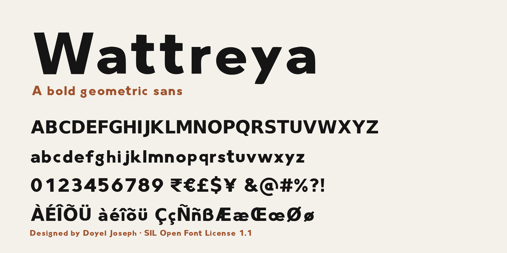

# Wattreya



Wattreya is a bold geometric sans serif. Its letters were drawn by hand and
digitised, giving clean geometric forms a slightly warmer, human edge. It is
suited to headlines, logos, signage and short display text.

The family has one style, Regular, and covers basic Latin and Western European
languages, with figures, punctuation and common currency symbols including the
Indian rupee sign (₹).

## About

Wattreya is designed by Doyel Joseph for Bilara Group.

## Repository layout

| Path | Contents |
| --- | --- |
| `fonts/ttf/` | Compiled font: `Wattreya-Regular.ttf` |
| `sources/` | Font source (`Wattreya-Regular.ufo`) and build configuration (`config.yaml`) |
| `documentation/` | Specimen image and article |
| `OFL.txt` | Licence |
| `AUTHORS.txt` | Copyright holders |
| `CONTRIBUTORS.txt` | People who contributed to the project |

## Building

Fonts are built from `sources/` with [gftools builder](https://github.com/googlefonts/gftools).
You need Python 3.10 or later.

```sh
make build
```

This creates a virtual environment, installs the requirements and writes the
compiled font to `fonts/ttf/`.

## Testing

Check the font against the Google Fonts requirements with
[FontBakery](https://github.com/fonttools/fontbakery):

```sh
make test
```

## Changelog

**1.400** (October 2026): first open-source release under the SIL Open Font License.

## License

This Font Software is licensed under the SIL Open Font License, Version 1.1.
This license is copied in [OFL.txt](OFL.txt), and is also available with a FAQ
at https://openfontlicense.org
