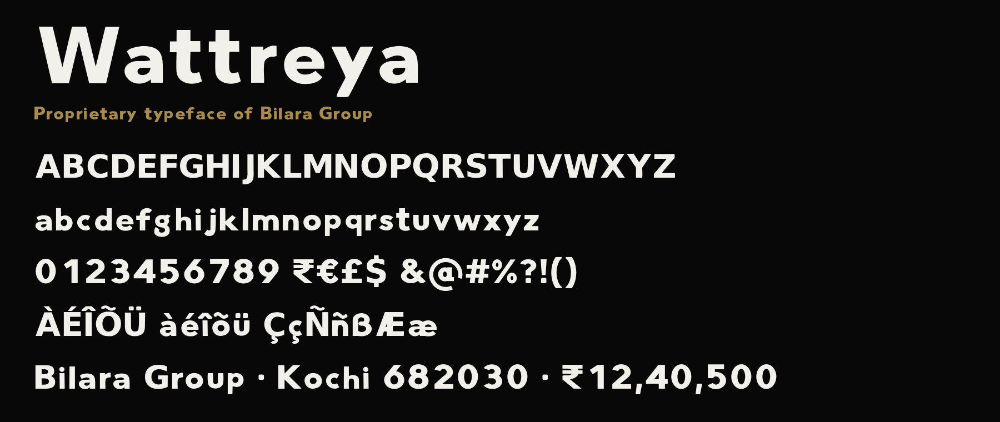

# Wattreya

Bilara Group's own typeface: a bold geometric sans for the brand, signage and
headings. **Proprietary and for internal use only** — see [LICENSE.md](LICENSE.md)
and [COPYRIGHT.md](COPYRIGHT.md).

| | |
| --- | --- |
| Version | 1.4 (final) |
| Style | Regular (one weight) |
| Characters | 210: A–Z, a–z, 0–9 (equal-width figures for tables), punctuation, ₹ € £ ¥ $ ¢, © ® ™, and Western European accented letters |
| Owner | Bilara Group |

## Files

| File | Use |
| --- | --- |
| `Wattreya-Regular.ttf` | Install on company computers (Word, PowerPoint, Excel, design apps) |
| `Wattreya-Regular.woff2` | Web version, for Bilara Group websites |
| `specimen.png` | Preview of the font |
| `LICENSE.md` | Who may use it and how |
| `COPYRIGHT.md` | Ownership record, version history and file fingerprints |

This repository is the master copy of the font. Keep it **private**.
The company website (`bilaragroup/BilaraGroup`) carries only its own copy of the
web font, at `app/fonts/Wattreya-Regular.woff2`.

## Installing

Remove any older copy of Wattreya (or "Trail 3" / "Wattr") first, then:

- **Windows:** right-click `Wattreya-Regular.ttf` → **Install for all users**. Restart Office apps.
- **Mac:** double-click `Wattreya-Regular.ttf` → **Install Font**. Restart open apps.
- **Canva (Pro/Teams):** Brand → Brand Kit → Fonts → Upload.

## Using it

- **Documents going outside the company:** export to PDF. The font embeds for
  viewing and printing only, so recipients see it correctly but cannot install it.
- **Printers and sign makers:** send PDFs or artwork with text converted to
  outlines. Do not send the font file (see LICENSE.md).
- **Company website (`bilaragroup/BilaraGroup`):** Tailwind class `font-brand`, or
  `font-family: var(--font-wattreya)`. The font is loaded in `app/fonts/wattreya.ts`;
  switch `preload` to `true` there once it is used above the fold.
- **Other websites or apps of Bilara Group:** use `Wattreya-Regular.woff2` with
  `@font-face`; never serve the `.ttf`.

## Updating the font

1. Replace both font files here, and `app/fonts/Wattreya-Regular.woff2` in the website repo.
2. Increase the version number inside the font.
3. Add a row to the version history and the new fingerprints in COPYRIGHT.md.

## Contact

Permissions and questions: Bilara Group management.
